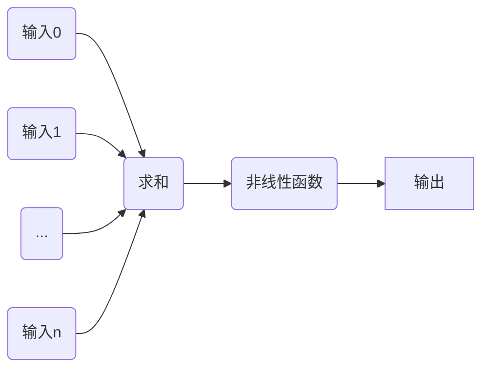
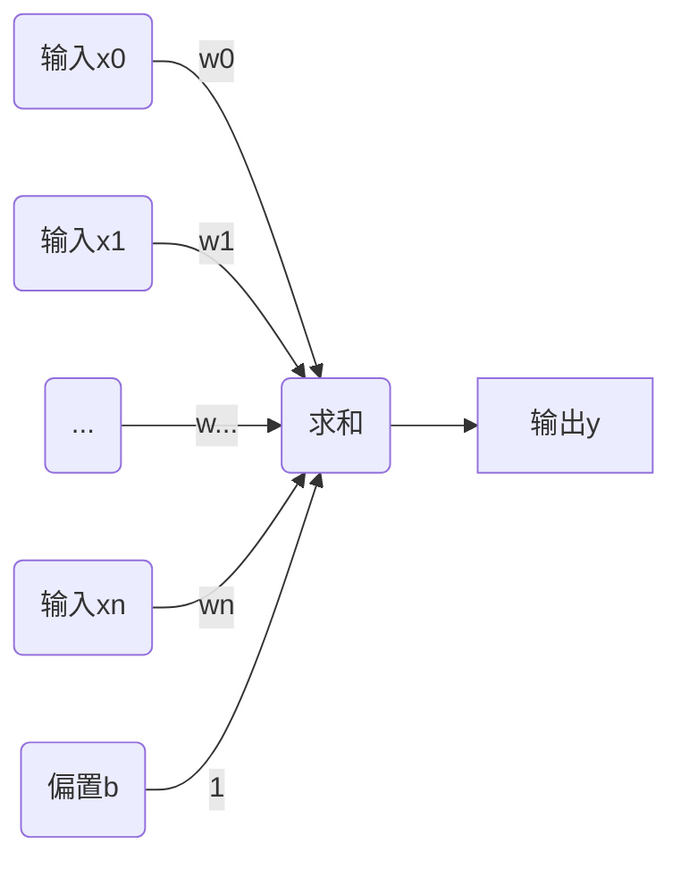

##### MP模型

```mermaid
graph LR
a(输入0)
b(输入1)
c(...)
d(输入n)
a --> e(求和)
b --> e(求和)
c --> e(求和)
d --> e(求和)
e --> f(非线性函数)
f --> 输出 
```

##### 简化后

```mermaid
graph LR
a(输入x0) --> |w0| f(求和)
b(输入x1) --> |w1| f(求和)
c(...) --> |w...| f(求和)
d(输入xn) --> |wn| f(求和)
e(偏置b) --> |1| f(求和)
f --> 输出y
```
>$$
y = x * w + b
$$